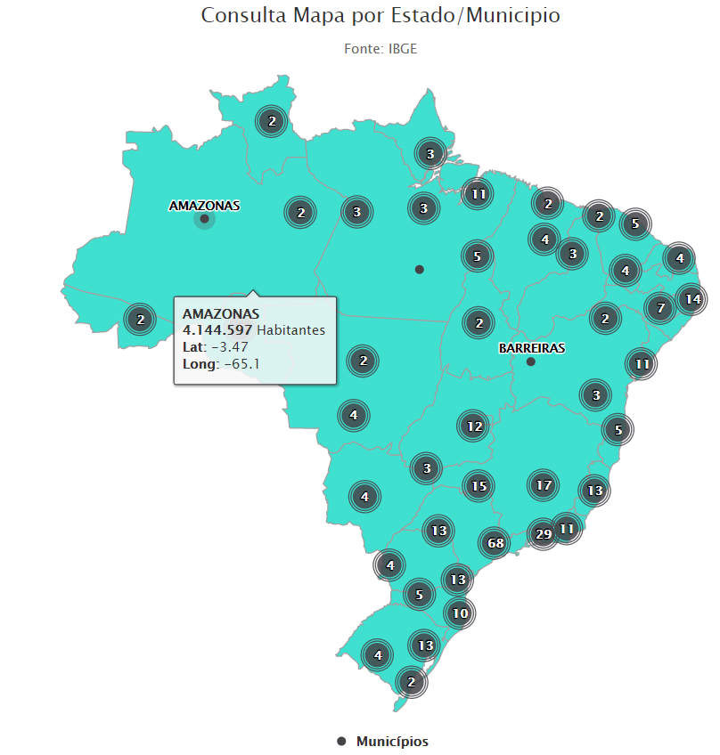

# mapeamento-dos-estados-municipios-brasileiros

Mapa do Brasil com os principais Estados/Municipios brasileiros

<b>O mapa contém:</b>
- Nome do Estado/Munícipio;
- Latitude/Longitude
- Quantidade de Habitantes

Feito baseado no mapa: https://www.highcharts.com/demo/maps/marker-clusters

- Demo: https://tifannyknox.github.io/mapeamento-dos-estados-municipios-brasileiros/

Enjoy!!! 
